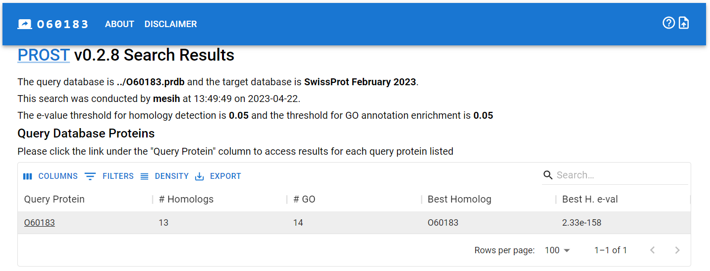
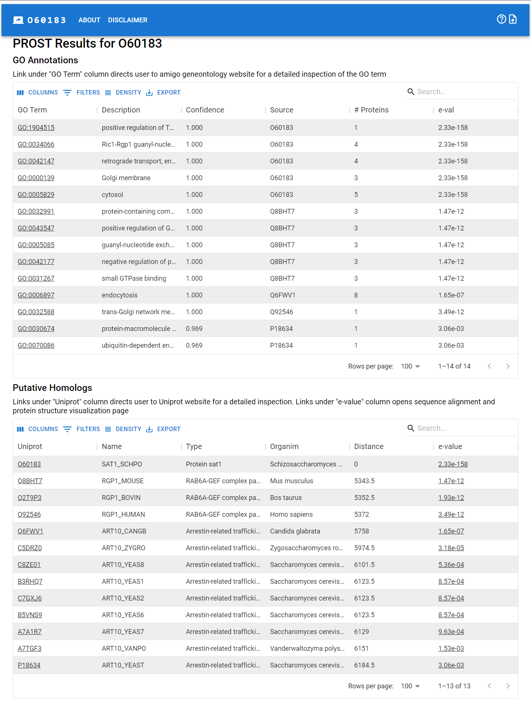
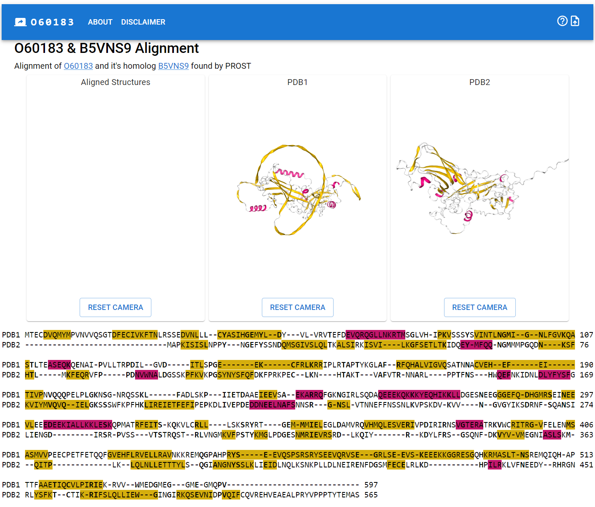

## PROST python package v0.2.14

PRotein Ortholog Search Tool is a new homolog detection tool that utilizes ESM-1b language model and iDCT quantization method.
PROST is fast and accurate compared to traditional tools. 

### Installation

The package can be installed with:
```
pip install pyprost
```
On the initial run, PROST will download required files to `~/.config/prost` or an user defined directory via `PROSTDIR` environment variable.

### How to use

Following commands can be used to create databases and perform homology search.

```
prost.py makedb db/sp.fa db/sp.prdb
prost.py makedb db/covid.fa db/covid.prdb
prost.py search --thr 0.05 --jobs 8 db/covid.prdb db/sp.prdb results
prost.py searchsp --thr 0.05 --jobs 8 db/covid.prdb results
prost.py tosjonwp -a -i 'info' results.tsv website
```

* `makedb`: creates a PROST database from given fasta file. The fasta file usually contains more than one entry.
* `search`: searches a query database agains a target database. Query database can contain one or more sequences embedded using makedb command. `--thr` can be used to specify an e-value threshold. The default threshold is 0.05. You can paralelize the search by using `--jobs` option.
* `searchsp`: searches a query database agains a SwissProt February 2023 database. Performs GO enrichment analysis on found homologs. Query database can contain one or more sequences embedded using makedb command. Again `--thr` can be used to specify an e-value threshold.  `--gothr` can be used to specifiy different e-value threshold for GO enrichment analysis. 
`searchsp` produces a tab seprataed file `.tsv` This file can be converted into a `.json` file that can be used with the tool [JSONWP](https://jsonwp.onrender.com/) using the command `prost.py tojsonwp -i 'Here is an info string to shown on website' results.tsv website`
Here is an example result:


Sequence alignment done automatically using the [PROTSUB](https://onlinelibrary.wiley.com/doi/full/10.1002/prot.26050) matrix which is better for aligning remote proteins then BLOSUM62 matrix. 
Protein structures are fetched from the Alphafold 2 database. No alignment produced this time.



### Scripting

```
import pyprost

hpo30 = '''MPLIMYKFLLVTSIFLIVSGLILTAFSLFSPLWEVVDFPRSHLSHHHGLWWDCIVHHET
LIPLHEDQAELRGDRCDSKMDSSVQASLRVALEKGDEEARELLLHRFLPHHKGVIFFAVF
TFVFGLISILIGSCSPCFPPNALLYVVGVFMTGACSLLADIIYIFAFNQKPIFTKEQSEP
HQEVLSRRERGSIGPIYKRLGIATYMHMFGSMLLIAAFIFSIFCAYFLITSKHAHDVCCT
SRKEYREQTKWKNNGLILKTGRVNHQSHRPFVVIDDDSSM'''

clc2 = '''MSQAVSYAILVLTIIAFLLTAAALCTPAWQVVYAREIRQWVQSGLWLSCQTRPNGMYSCT
YTFSHDDFNTYFSDEVSGFRTPSFYPWQRTLFHIYLISQAFAMLSLISFCVSVSHKESKM
PNILRSVFLVLAAVIAFGCLIAFAVYSYMVEYRFFHVSVSGIYEKHRGYSWYIALTGAFV
YLVAIILSVVHVLLQARNSNTTMSRQNINSSLQSDFFEYQYHPNRSMESFEDRFAMRTLP
PVPRQEKKTTVF'''

hpo30embedding = pyprost.quantSeq(hpo30)
clc2embedding = pyprost.quantSeq(clc2)

dist = pyprost.prostDistance(hpo30embedding,clc2embedding)
print('HPO30-CLC2 prost distance:',dist)
#Should print: HPO30-CLC2 prost distance: 3479.0
#Distance smaller than 6875 may indicate homology
```

### Resources

* Yeast analysis: https://mesihk.github.io/prostyeast
* Unannotated Human Proteins Analysis: https://mesihk.github.io/prosthuman
* Webserver: https://mesihk.github.io/prost 
* PROST Python package: https://github.com/MesihK/prost
* PROST Research Data: https://github.com/MesihK/prost-data 
* JSONWP: https://jsonwp.onrender.com/
